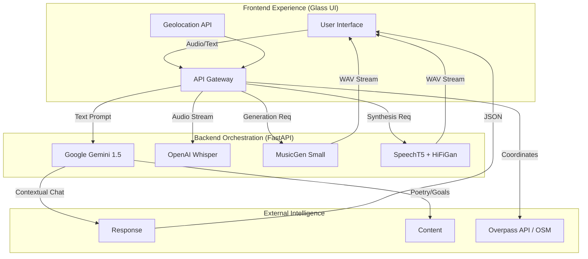

# 🌌 MANAS AI WELLNESS
### *The Ethereal Bio-Digital Sanctuary*

[](https://fastapi.tiangolo.com/)
[](https://pytorch.org/)
[](https://huggingface.co/)
[](https://deepmind.google/technologies/gemini/)
[](https://github.com/openai/whisper)
[](https://developer.mozilla.org/en-US/docs/Web/JavaScript)

**Manas AI** is not just a wellness app; it is a **Multimodal Neural Ecosystem**. It fuses state-of-the-art Generative AI, Audio Synthesis Transformers, and Geospatial APIs into a unified, glassmorphic interface designed to recalibrate user mental states through bio-digital intervention.

[View Demo](https://huggingface.co/spaces/SALMA003/Manas_AI_Wellness) | [Report Bug](https://huggingface.co/spaces/SALMA003/Manas_AI_Wellness/discussions)

</div>

---

## 🧠 System Architecture & Core Intelligence

Manas operates on a decoupled client-server architecture, leveraging a high-performance **FastAPI** backend that orchestrates a pipeline of heavy transformer models.



### 🚀 Key Technical Pillars

#### 1. Generative Audio Synthesis (MusicGen)
We don't play pre-recorded loops. Manas generates **bespoke ambient soundscapes** in real-time.
*   **Model:** `facebook/musicgen-small`
*   **Pipeline:** User Keyword $\rightarrow$ LLM Prompt Expansion $\rightarrow$ Transformer Audio Generation $\rightarrow$ FFMPEG Processing $\rightarrow$ Binary Stream.

#### 2. Neural Speech Ecosystem
A bidirectional speech pipeline enabling seamless voice interaction.
*   **STT (Ear):** `openai/whisper-base` for robust automatic speech recognition.
*   **TTS (Voice):** `microsoft/speecht5_tts` coupled with **HiFiGan** vocoders and CMU Arctic X-Vector embeddings for lifelike vocal synthesis.

#### 3. Cognitive Reasoning Engine
Powered by **Google Gemini 1.5 Flash**, the backend handles complex reasoning tasks:
*   **Contextual Chat:** Maintains conversation history for coherent therapy-lite sessions.
*   **Algorithmic Goal Coaching:** Converts abstract user desires into S.M.A.R.T. actionable JSON plans.
*   **Dynamic Meditation Scripts:** Generates session scripts based on user-selected duration and stress levels.

#### 4. Geospatial Safety Locator
Integrates with the **Overpass API** to perform real-time radius queries on OpenStreetMap data, triangulating user coordinates to locate "Safe Zones" (Libraries, Parks, Cafes) within a 2000m radius.

---

## 🎨 Frontend Engineering: The "Ethereal" UX

The interface is built with vanilla **ES6+ JavaScript** for maximum performance, avoiding framework bloat.

*   **Glassmorphism Engine:** CSS3 backdrop filters (`blur(12px)`) combined with semi-transparent RGBA layers.
*   **Parallax Aurora Effects:** GPU-accelerated CSS animations (`transform: translate3d`) track mouse movement to create depth.
*   **Gamification Logic:** Local state management handles XP tracking, leveling systems, and feature unlocking without database latency.

---

## 🛠️ Installation & Deployment

### Prerequisites
*   **Python 3.10+** (Required for Torch/Transformers)
*   **FFMPEG** (Critical for audio processing - `pydub` dependency)
*   **CUDA-capable GPU** (Recommended for MusicGen/Whisper inference)

### 1. Clone & Environment
```bash
git clone https://huggingface.co/spaces/SALMA003/Manas_AI_Wellness
cd Manas_AI_Wellness
python -m venv venv
source venv/bin/activate  # or venv\Scripts\activate
```

### 2. Install Dependencies
```bash
pip install -r requirements.txt
# Ensure torch is installed with CUDA support if available
```

### 3. Environment Configuration
Create a `.env` file in the root directory:
```env
GEMINI_API_KEY=your_google_api_key_here
HF_TOKEN=your_huggingface_token_here
```

### 4. Launch the Neural Backend
```bash
uvicorn main:app --host 0.0.0.0 --port 7860
```

---

## 📡 API Documentation

| Endpoint | Method | Payload | Description |
| :--- | :--- | :--- | :--- |
| `/api/chat` | `POST` | `{"history": []}` | Context-aware LLM conversation |
| `/api/generate-soundscape` | `POST` | `{"word": "forest"}` | Generates 5s audio clip via MusicGen |
| `/api/transcribe` | `POST` | `FormData(file)` | Converts user audio to text via Whisper |
| `/api/safe-zones` | `POST` | `{"lat": x, "lon": y}` | OSM query for nearby safe spaces |
| `/api/coach-goal` | `POST` | `{"goal": "..."}` | Generates structured action plans |

---

## 💻 Code Highlight: Audio Generation Pipeline

Manas doesn't just call an API; it runs the diffusion processing locally (or on the hosted GPU instance).

```python
# main.py
@app.post("/api/generate-soundscape")
async def generate_soundscape(request: SoundscapeRequest):
    # 1. LLM Expands the user's simple word into a descriptive acoustic prompt
    prompt_response = gemini_model.generate_content(
        f"Describe a soothing soundscape for '{request.word}'. Focus on instruments/texture."
    )
    
    # 2. Tokenize and feed to MusicGen
    inputs = audio_gen_processor(
        text=[prompt_response.text], 
        padding=True, 
        return_tensors="pt"
    ).to(device)
    
    # 3. Generate Audio Tensor
    audio_values = audio_gen_model.generate(**inputs, max_new_tokens=768)
    
    # 4. Stream binary WAV back to client
    buffer = io.BytesIO()
    sf.write(buffer, audio_values.cpu().numpy().squeeze(), samplerate=32000, format='WAV')
    return StreamingResponse(buffer, media_type="audio/wav")
```

---

## 🔮 Future Roadmap

*   **Biometric Integration:** WebCam-based rPPG (Remote Photoplethysmography) to detect heart rate variability.
*   **Sentiment Voice Analysis:** Analyzing user vocal tonality to auto-adjust app themes and suggestions.
*   **VR/XR Port:** Porting the Aurora background to a WebXR environment for immersive meditation.

---

<div align="center">

**Built with 💜 by SALMA003**
<br>
*Merging Silicon & Spirit*

</div>
