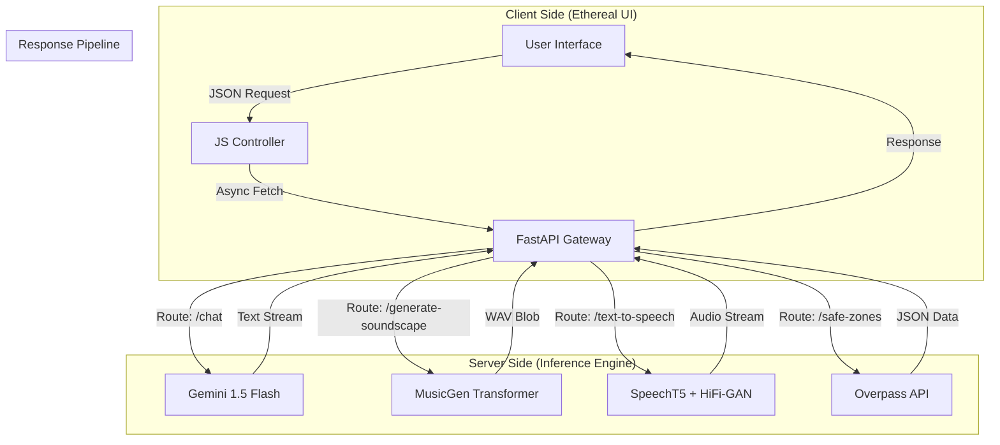

# 🌌 MANAS: AI Wellness Sanctuary
### *Next-Gen Psychotherapeutic AI Companion*

[](https://fastapi.tiangolo.com/)
[](https://python.org)
[](https://deepmind.google/technologies/gemini/)
[](https://huggingface.co/)
[](https://pytorch.org/)

**MANAS** (Mental health & Artificial Neural Assistance System) is a comprehensive wellness platform capable of multimodal interaction. It fuses **Generative AI** for cognitive therapy, **Transformer-based Audio Synthesis** for ambient soundscapes, and a **Reactive Ethereal UI** to create a holistic digital sanctuary.

---

## 📦 Technical Architecture Matrix

Here is the complete breakdown of the technologies powering the Manas Ecosystem.

| **Domain** | **Technology Stack** | **Specific Tools & Models** | **Functionality / Role** |
| :--- | :--- | :--- | :--- |
| **🖥️ Frontend** | **Vanilla JS (ES6+)**, **CSS3**, **HTML5** | • **Glassmorphism UI**<br>• **Parallax Engine**<br>• **CSS Variables** | • Reactive SPA architecture<br>• Zero-dependency lightweight framework<br>• 60FPS Ambient particle animations |
| **⚙️ Backend** | **Python**, **FastAPI** | • **Uvicorn** (ASGI Server)<br>• **Pydantic** (Data Validation)<br>• **CORSMiddleware** | • High-performance asynchronous API<br>• Streaming audio responses<br>• Robust error handling pipeline |
| **🧠 NLP Core** | **Generative AI** | • **Google Gemini 1.5 Flash**<br>• **Prompt Engineering** | • Context-aware Chat Companion<br>• Goal S.M.A.R.T. Planning<br>• Wisdom Riddle Generation |
| **🗣️ Speech Engine** | **Transformers**, **PyTorch** | • **Microsoft SpeechT5** (TTS)<br>• **HiFi-GAN** (Vocoder)<br>• **OpenAI Whisper** (STT) | • Neural Text-to-Speech synthesis<br>• High-fidelity waveform generation<br>• Real-time voice transcription |
| **🎵 Audio Synthesis** | **Latent Diffusion** | • **Facebook MusicGen Small**<br>• **FFmpeg**<br>• **PyDub** | • **"Echo Cave"**: Text-to-Audio ambient generation<br>• Waveform processing & normalization |
| **🌍 Data & Geo** | **External APIs** | • **OpenStreetMap (Overpass)**<br>• **Geolocation API** | • "Safe Zone" Locator (Libraries, Parks)<br>• Privacy-first browser-based location tracking |

---

## 🧠 System Workflow

The application relies on a sophisticated pipeline handling separate threads for textual logic and heavy tensor computations for audio generation.



---

## 🚀 Key Features

### 1. The Echo Cave (Generative Audio)
Utilizing **Facebook's MusicGen**, Manas generates unique, never-before-heard ambient soundscapes based on user emotion.
*   *Tech:* AutoProcessor -> MusicGenForConditionalGeneration -> 32kHz Sampling.

### 2. Neural Voice Interface
A complete vocal loop allowing users to speak and hear responses.
*   **Input:** OpenAI Whisper Base (Automatic Speech Recognition).
*   **Output:** Microsoft SpeechT5 (Text-to-Speech) using CMU Arctic X-Vectors for speaker embedding.

### 3. Cognitive AI Coach
Powered by **Google Gemini**, the backend maintains conversation history to provide context-aware CBT (Cognitive Behavioral Therapy) inspired support, S.M.A.R.T. goal planning, and poetic generation.

### 4. Digital Detox & Mindfulness
Includes a custom-built timer engine for:
*   **Breathing Exercises:** Visual 4-7-8 and Box Breathing guides.
*   **Detox Pledges:** AI-generated commitment contracts.

---

## 🛠️ Installation & Setup

### Prerequisites
*   Python 3.10+
*   FFmpeg (Installed and added to System PATH)
*   A Google Gemini API Key

### 1. Clone the Repository
```bash
git clone https://huggingface.co/spaces/SALMA003/Manas_AI_Wellness
cd Manas_AI_Wellness
```

### 2. Install Dependencies
```bash
pip install -r requirements.txt
```
*Note: This will install heavy libraries including `torch`, `transformers`, and `fastapi`.*

### 3. Configure Environment
Create a `.env` file in the root directory:
```env
GEMINI_API_KEY=your_google_api_key_here
```

### 4. Run the Server
```bash
uvicorn main:app --reload --host 0.0.0.0 --port 7860
```

### 5. Access the App
Open your browser and navigate to:
`http://localhost:7860`

---

## 🔮 Future Roadmap

*   [ ] **RAG Integration:** Vector database implementation to store long-term user therapy sessions.
*   [ ] **Emotion Detection:** Computer Vision (OpenCV) integration to detect user facial expressions for auto-mood logging.
*   [ ] **Biometric Sync:** Integration with wearable API data (Apple Health/Google Fit).

---

<div align="center">
  <sub>Designed & Engineered by SALMA003</sub><br>
  <sub>Powered by Open Source AI</sub>
</div>
